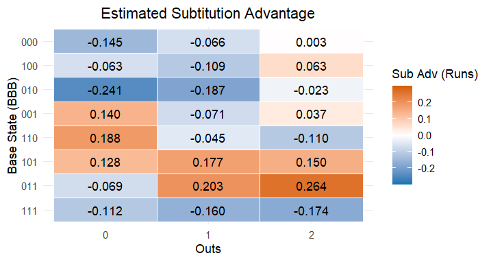

# When to Pull the Pitcher: An Absorbing Markov Chain Approach

James Chen & Charlie Ko, 11/6/2025

---

## 1. Problem Statement
During a close game in baseball, any tiny decision such as a substitute in  a pinch hitter or a reliever could dramatically change the outcome of the come. This study aims to provide a Markov chain analysis to assist coaching staff to evaluate the optimal timing to pull the starter in the inning to reduce points lost. To demonstrate the practical relevance of our model, we decide to apply it to a highly controversial real-world scenario: Houston manager A.J. Hinch’s decision to remove Zack Greinke in the 7th inning of World Series Game 7, which was widely regarded as one of the most controversial pitching substitutions in recent Major League Baseball (MLB) history. Beyond the famous 2019 case, we hope to develop a framework with the adapability to explore substitution strategies across a wide spectrum of game conditions.

---

## 2. Data and Methodology 

### 2.1 Scraping and construct play-by-play dataset

The 2024 Statcast data was collected using the [scraper](https://github.com/skdeshpande91/stat479_fall2025/blob/main/scripts/annual_statcast_query.R) that utilizes `baseballr::statcastsearch()`. After scraping the data, we kept only regular-season games and the columns of interest. Since we analyze only full innings, the dataset includes only the first eight innings of each game.  We also use `baseballr` to access the Chadwick player register, which is useful for creating a id–name lookup table for pitchers.

Library:
```
library(baseballr)
library(dplyr)
library(tidyverse)
library(readr)
library(ggplot2)
library(colorBlindness)
```

Scraper:
```
## Code modified from Bill Petti's original annual Statcast scraper:
## Main change is in the column names of the fielders

annual_statcast_query <- function(season) {
  
  data_base_column_types <- 
    readr::read_csv("https://app.box.com/shared/static/q326nuker938n2nduy81au67s2pf9a3j.csv")
  
  dates <- 
    seq.Date(as.Date(paste0(season, '-03-01')),
             as.Date(paste0(season, '-12-01')), 
             by = '4 days')
  
  date_grid <- 
    tibble::tibble(start_date = dates, 
                   end_date = dates + 3)
  
  safe_savant <- 
    purrr::safely(baseballr::scrape_statcast_savant)
  
  payload <- 
    purrr::map(.x = seq_along(date_grid$start_date),
               ~{message(paste0('\nScraping week of ', date_grid$start_date[.x], '...\n'))
                 payload <- 
                   safe_savant(start_date = date_grid$start_date[.x], 
                               end_date = date_grid$end_date[.x], 
                               type = 'pitcher')
                 return(payload)
               })
  
  payload_df <- purrr::map(payload, 'result')
  
  number_rows <- 
    purrr::map_df(.x = seq_along(payload_df),
                  ~{number_rows <- 
                    tibble::tibble(week = .x, 
                                   number_rows = length(payload_df[[.x]]$game_date))
                  }) %>%
    dplyr::filter(number_rows > 0) %>%
    dplyr::pull(week)
  
  payload_df_reduced <- payload_df[number_rows]
  
  payload_df_reduced_formatted <- 
    purrr::map(.x = seq_along(payload_df_reduced), 
               ~{cols_to_transform <- 
                 c("pitcher", "fielder_2", "fielder_3",
                   "fielder_4", "fielder_5", "fielder_6", "fielder_7",
                   "fielder_8", "fielder_9")
               df <- 
                 purrr::pluck(payload_df_reduced, .x) %>%
                 dplyr::mutate_at(.vars = cols_to_transform, as.numeric) %>%
                 dplyr::mutate_at(.vars = cols_to_transform, function(x) {ifelse(is.na(x), 999999999, x)})
               character_columns <- 
                 data_base_column_types %>%
                 dplyr::filter(class == "character") %>%
                 dplyr::pull(variable)
               numeric_columns <- 
                 data_base_column_types %>%
                 dplyr::filter(class == "numeric") %>%
                 dplyr::pull(variable)
               integer_columns <- 
                 data_base_column_types %>%
                 dplyr::filter(class == "integer") %>%
                 dplyr::pull(variable)
               df <- 
                 df %>%
                 dplyr::mutate_if(names(df) %in% character_columns, as.character) %>%
                 dplyr::mutate_if(names(df) %in% numeric_columns, as.numeric) %>%
                 dplyr::mutate_if(names(df) %in% integer_columns, as.integer)
               return(df)
               })
  
  combined <- payload_df_reduced_formatted %>%
    dplyr::bind_rows()
  
  return(combined)
}
```

Load data and initial cleaning
```
# raw_statcast2024 <- annual_statcast_query(2024)
# save(raw_statcast2024, file = "raw_statcast2024.RData")

# Load from saved file
load("raw_statcast2024.RData")

# Load the Chadwick player register
# chadwick_players <- baseballr::chadwick_player_lu()
# save(chadwick_players, file = "chadwick_players.RData")
load("chadwick_players.RData")

# filter potential useful columns
useful_columns <- c("game_date", "player_name", "player", "batter",  "pitcher",
                   "events", "description", "game_type", "stand", "p_throws", "home_team", 
                   "away_team", "balls", "strikes", "game_year", "on_3b", "on_2b", 
                   "on_1b", "outs_when_up", "inning", "inning_topbot", "game_pk", 
                   "at_bat_number", "pitch_number", "pitch_name", "bat_score", 
                   "fld_score", "post_bat_score", "post_fld_score", "delta_run_exp",
                   "age_pit", "n_thruorder_pitcher", "bat_score_diff")

# Clean data and create BaseRunner column
# Keep only regular season & 1-8 innings
game_seq <- raw_statcast2024 %>% 
  dplyr::select(any_of(useful_columns)) %>%
  filter(game_type == "R", inning < 9) %>% 
  arrange(game_date, desc(game_pk), factor(inning_topbot, levels = c("Top", "Bot")),
    inning, at_bat_number, pitch_number) %>% 
  rename(pitcher_id = pitcher) %>% 
  dplyr::mutate(
    BaseRunner = 
      paste0(1*(!is.na(on_1b)),1*(!is.na(on_2b)),1*(!is.na(on_3b))))
```


To better understand each pitcher’s season-long performance, we construct a pitcher profile dataset that summarizes key metrics such as average, median, and maximum pitch counts, along with each pitcher’s repertoire. In addition, we also assign a role label, “starter,” “long reliever,” or “short reliever”, based on the maximum number of pitches thrown in a single game. This role classification is especially useful for determining appropriate fatigue-level thresholds in later analysis.
```
# Prepare a pitcher look up
pitcher_lookup <- chadwick_players %>%
  filter(!is.na(key_mlbam)) %>%
  transmute(mlbam_id = key_mlbam,
            pitcher_name = paste(name_first, name_last)) %>% 
  rename(pitcher_id = mlbam_id)

pitcher_info <- game_seq %>%
  group_by(game_pk, pitcher_id) %>%
  summarise(n_pitch = n(), .groups = "drop") %>%   # count pitches per game per pitcher
  group_by(pitcher_id) %>%
  summarise(pitch_avg = mean(n_pitch),
            pitch_med = median(n_pitch),
            max_pitch = max(n_pitch),
            n_game = n(),
            .groups = "drop") %>%  # average across all games
  mutate(role = case_when(
    max_pitch >= 80 ~ "starter",
    max_pitch >= 50 ~ "long_reliever",
    TRUE           ~ "reliever"
  ))


pitch_mix <- game_seq %>%
  filter(!is.na(pitch_name)) %>%
  group_by(pitcher_id, pitch_name) %>%
  summarise(n_pitch = n(), .groups = "drop_last") %>%
  mutate(total_pitch = sum(n_pitch)) %>%
  ungroup() %>%
  mutate(perc = 100 * n_pitch / total_pitch) %>%
  group_by(pitcher_id) %>%
  # only keep pitch types that are at least 5% of total usage, and 30 pitches thrown
  filter(perc >= 5, n_pitch > 30) %>%
  mutate(repertoire = n_distinct(pitch_name)) %>%          # count of qualifying pitches
  slice_max(n_pitch, n = 2, with_ties = FALSE) %>%
  arrange(pitcher_id, desc(perc)) %>%
  summarise(
    top1_pitch = first(pitch_name),
    top1_perc  = first(perc),
    top2_pitch = nth(pitch_name, 2),
    top2_perc  = nth(perc, 2),
    repertoire = first(repertoire), 
    .groups = "drop"
  )

# combine pitcher information and pitch mix
pitcher_profile <- pitcher_lookup %>% 
  right_join(pitcher_info) %>% 
  left_join(pitch_mix)

# Half_inning_scores
game_seq <- game_seq %>%
  arrange(game_pk, inning, inning_topbot, at_bat_number, pitch_number)

half_inning_scores <- game_seq %>%
  group_by(game_pk, inning, inning_topbot) %>%
  summarise(
    # Batting team’s score at the very end of the half-inning
    half_inning_end_bat_score = max(post_bat_score, na.rm = TRUE), 
    .groups = "drop"
  )
```

Using our constructed dataset, we define conditioning variables: pitcher fatigue level, run differential, number of the times through the order, and a metric that evaluates the performance in the previous innings. 

To summarize a pitcher’s performance entering a new inning, we develop the Exponential Weighted Runs Allowed (EWRA) metric, a recency-aware score that emphasizes recent performance while gradually fading the influence of earlier innings. For each inning, we define Stress-Adjust Run Allowed (SARA) that includes both actual runs and a stress bump to account for demanding innings: innings in which a pitcher throws 20 or more pitches are treated as contributing an additional 0.5 effective runs, reflecting the well-established impact of stressful innings on subsequent performance. EWRA is then computed recursively using an exponential decay factor governed by a half-life parameter, ensuring that recent innings carry more weight while older, potentially anomalous events diminish smoothly. This produces a single, interpretable measure of a pitcher’s short-term form and stability entering the upcoming inning.

<div style="font-size: 140%;">
  
$$
\begin{aligned}
\textbf{EWRA}_0 &= 0, \\
\textbf{EWRA}_i &= \boldsymbol{\lambda} \cdot \textbf{EWRA}_{i-1} + \textbf{SARA}_{i}, \\
\textbf{SARA}_i &= \min(\text{runs}_i, \mathbf{c}) + \boldsymbol{\alpha} \cdot \mathbf{1}{\{\text{pitches} \ge 20\}}, \\
\mathbf{i} &= \text{i-th inning}, \\
\boldsymbol{\lambda} &= 0.5^{\tfrac{1}{\mathbf{h}}}, \\
\mathbf{h} &= \text{half-life}, \\
\mathbf{c} &= \text{cap runs}, \\
\boldsymbol{\alpha} &= \text{stress bump}.
\end{aligned}
$$

</div>

We classify pitcher fatigue into five levels—Fresh, Settled-In, Working Load, Fatigued, and Redline. The thresholds between levels differ by role, since starters typically carry a higher pitch count than relievers. To better filter the in-game circumstances, such as leading, trailing,  and pitcher’s performance entering the new inning, we classify the score difference into five groups and EWRA into three groups as well.

Pitcher Fatigue Level Thresholds by Roles

| **Role**         | **Fresh** | **Settled-In** | **Working Load** | **Fatigued** | **Redline** |
|------------------|-----------|----------------|------------------|---------------|--------------|
| **Starter**       | 0–30      | 31–60          | 61–85            | 86–100        | 101+         |
| **Long Reliever** | 0–20      | 21–40          | 41–55            | 56–70         | 71+          |
| **Reliever**      | 0–15      | 16–25          | 26–35            | 36–45         | 46+          |


Score Difference Binning
| **Score Difference (Def − Off)** | **Group**      |
|----------------------------------|----------------|
| < −3                             | trail_big      |
| −3 to −1                         | trail_small    |
| 0                                | tie            |
| 1 to 3                           | lead_small     |
| > 3                              | lead_big       |

EWRA Performance Binning
| **EWRA Value (x)** | **Group** |
|---------------------|------------|
| x < 0.7             | good       |
| 0.7 ≤ x < 1.5       | ok         |
| x ≥ 1.5             | risky      |

To compute run expectancy and game-state transition probabilities, we collapse pitch-level “game_seq” to the at-bat level, keeping the batter, starting base/out state, pitcher info, pitch count per AB, times through the order, and the pitcher’s fatigue level over the AB. In our Markov-chain analysis, we set 3.000 (three outs) as the absorbing state, and each AB has a current and next state label.

Adding conditional variables
```
# Add pitching_team and establish strict ordering, pitch order
game_seq <- game_seq %>%
  mutate(
    pitching_team = if_else(inning_topbot == "Top", home_team, away_team),
    half = factor(inning_topbot, levels = c("Top", "Bot"))
  ) %>%
  arrange(game_pk, pitching_team, inning, half, at_bat_number, pitch_number) %>%
  group_by(game_pk, pitching_team) %>%
  mutate(row_in_group = row_number()) %>%
  
  # First appearance row for each pitcher within game_pk × pitching_team
  group_by(game_pk, pitching_team, pitcher_id) %>%
  mutate(first_row_for_pitcher = min(row_in_group)) %>%
  ungroup() %>%
  group_by(game_pk, pitching_team) %>%
  mutate(pitcher_order = dense_rank(first_row_for_pitcher)) %>%
  ungroup()

# Pitch count
game_seq <- game_seq %>%
  # Make sure pitches are in true game order
  mutate(half = factor(half, levels = c("Top", "Bot"))) %>% 
  arrange(game_pk, pitcher_id, inning, half, at_bat_number, pitch_number) %>%
  group_by(game_pk, pitcher_id) %>%
  mutate(pitch_count = row_number()) %>%
  ungroup()

level_names <- c("Fresh", "Settled-In", "Working Load", "Fatigued", "Redline")

# Fatigue level
role_cuts <- tribble(
  ~role,           ~c1, ~c2, ~c3, ~c4, ~c5,  # c5 is the "above" bucket
  "starter",        30,   60,   85,  100, Inf,
  "long_reliever",  20,   40,   55,   70, Inf,
  "reliever",       15,   25,   35,   45, Inf
)

game_seq <- game_seq %>%
  # Bring in the thresholds per pitcher
  left_join(
    pitcher_profile %>%
      select(pitcher_id, role),
    by = "pitcher_id"
  ) %>%
  left_join(role_cuts, by = "role") %>%
  # Assign a fatigue label for each pitch (based on cumulative pitch_count)
  mutate(fatigue_level = case_when(
    pitch_count <= c1  ~ "Fresh",
    pitch_count <= c2  ~ "Settled-In",
    pitch_count <= c3  ~ "Working Load",
    pitch_count <= c4  ~ "Fatigued",
    pitch_count <= c5  ~ "Redline"
  ),
    # Ordered factor
    fatigue_level = factor(fatigue_level, levels = level_names, ordered = TRUE),
    # Numeric code 1–5
    fatigue_level_num = as.integer(fatigue_level)
  ) %>%
  select(-c1, -c2, -c3, -c4, -c5)

# Flip the sign of bat_score_diff for pitch_score_diff
game_seq <-game_seq %>%  mutate(pitch_score_diff= bat_score_diff*-1)
```

Create AB dataset
```
ab <- game_seq %>%
  group_by(game_pk, inning, at_bat_number, inning_topbot) %>%
  summarise(
    game_date          = first(game_date),
    batter             = first(batter),
    player_name        = first(player_name),
    start_outs         = first(outs_when_up),
    start_baserunners  = first(BaseRunner),
    start_bat_score    = first(bat_score),
    end_post_bat_score = last(post_bat_score),

    # Pitcher info + fatigue over the AB
    pitcher_id         = first(pitcher_id),
    pitcher_order      = first(pitcher_order),
    fatigue_min        = suppressWarnings(min(fatigue_level_num, na.rm = TRUE)),
    fatigue_max        = suppressWarnings(max(fatigue_level_num, na.rm = TRUE)),
    n_pitch_ab         = n(),
    
    n_thruorder_pitcher = first(n_thruorder_pitcher),
    bat_score_diff       = first(bat_score_diff),
    pitch_score_diff     = first(pitch_score_diff),
    .groups = "drop"
  ) %>%
  # Re-group by half-inning so lead() looks within the half-inning
  group_by(game_pk, inning, inning_topbot) %>%
  arrange(at_bat_number, .by_group = TRUE) %>%
  mutate(
    # Next AB's start state
    next_outs        = lead(start_outs),
    next_baserunners = lead(start_baserunners),

    # If next is missing (last ab in half-inning) or resets to 0.000 (new half-inning),
    # Force absorbing 3.000 for this ab's end state
    end_outs = ifelse(is.na(next_outs) | (next_outs == 0 & next_baserunners == "000"), 3L, next_outs),
    end_baserunners = ifelse(is.na(next_baserunners) | (next_outs == 0 & next_baserunners == "000"), "000", next_baserunners),

    GameState     = sprintf("%d.%s", start_outs, start_baserunners),
    end_GameState = sprintf("%d.%s", end_outs,   end_baserunners)
  ) %>%
  ungroup()

# Run scored against
ab <- ab %>%
  left_join(half_inning_scores, by = c("game_pk", "inning", "inning_topbot")) %>%
  mutate(
    runs_scored_in_ab      = end_post_bat_score - start_bat_score,
    future_runs_from_start = half_inning_end_bat_score - start_bat_score
  )
```

Exponential Weighted Run Allowed (EWRA)
```
half_life_inn <- 1.5       # h
cap_runs      <- 3         # c
stress_bump   <- 0.5       # alpha

decay <- 0.5^(1/half_life_inn)  # lambda

# Per-inning runs allowed + simple stress flag for each pitcher-game
runs_by_inning <- ab %>%
  group_by(game_pk, pitcher_id, inning, inning_topbot) %>%
  summarise(
    runs_allowed = sum(pmax(runs_scored_in_ab, 0), na.rm = TRUE),
    n_pitch_ip    = sum(n_pitch_ab),
    .groups = "drop_last"
  ) %>%
  arrange(game_pk, pitcher_id, inning) %>%
  mutate(
    runs_capped = pmin(runs_allowed, cap_runs),
    stress_flag = as.integer(n_pitch_ip >= 20),
    sara    = runs_capped + stress_bump * stress_flag # Stress-Adjusted Run Allowed (SARA)
  )

# 2) EWRA calculation
ewra_enter <- runs_by_inning %>%
  group_by(game_pk, pitcher_id) %>%
  arrange(inning, .by_group = TRUE) %>%
  mutate(
    # accumulate over SARA to get EWRA at the END of each inning
    EWRA_end = accumulate(sara, ~ .x * decay + .y, .init = 0) %>% tail(-1),
    # entering the current inning = end of previous inning
    EWRA_enter = dplyr::lag(EWRA_end, default = 0)
  ) %>%
  ungroup() %>%
  select(game_pk, pitcher_id, inning, EWRA_enter)

# join with ab
ab <- ab %>%
  left_join(ewra_enter, by = c("game_pk", "pitcher_id", "inning"))
```

Binning score difference & EWRA
```
ab <- ab %>% arrange(game_date, game_pk, at_bat_number)

# Bin the conditioning variables to better filter the case
score_bin <- function(x) dplyr::case_when(
  x < -3 ~ "trail_big",
  x >= -3 & x <= -1 ~ "trail_small",
  x ==  0 ~ "tie",
  x >= 1 & x <= 3 ~ "lead_small",
  x >  3 ~ "lead_big",
  TRUE     ~ NA_character_
)

ewra_bin <- function(x) dplyr::case_when(
  x < 0.7 ~ "good",
  x < 1.5 ~ "ok", 
  x >=  1.5 ~ "risky",
  TRUE     ~ NA_character_
)

ab <- ab %>% 
  mutate(score_bin = score_bin(pitch_score_diff),
         ewra_bin = ewra_bin(EWRA_enter))
```

### 2.2 Markov Chain Set Up

We first  isolate the game situations that match the context we want to study: a small lead with the starter performing well under our EWRA metric. The “keep” dataset includes starters who are either at a moderate fatigue level or facing the lineup for the third time, capturing moments when managers often debate whether to leave the starter in. The “sub” dataset includes relievers who enter the game right after the starter and are facing the lineup for the first time, representing a typical fresh bullpen option.
```
# Game context (only for this specific case, can be modified):
# 1. Defensing team has small lead and starting pitcher in good condition.
# 2. Starter is a little tired (60-85 pitches) or 3rd+ time through the order.

score_ctx <- "lead_small"
ewra_ctx <- "good"

df_keep <- ab %>%
  filter(score_bin == score_ctx,
         ewra_bin == ewra_ctx,
         pitcher_order == 1,
         fatigue_min == 3 | n_thruorder_pitcher >= 3)

# Sub: only keep the data of first time through the order
df_sub <- ab %>%
  filter(score_bin == score_ctx,
         pitcher_order == 2,
         n_thruorder_pitcher == 1)
```

Then, we construct the transition matrices that describe how an inning typically progresses under each decision. Using the filtered datasets for keeping the starter and for bringing in a reliever, we count how often each game state moves to the next and convert those frequencies into transition probabilities. We also specify the inning-ending state as absorbing to ensure the simulation correctly terminates once three outs are reached. These probabilities are then arranged into transition matrices for the “keep” and “sub” scenarios, which serve as the foundation for all subsequent Monte Carlo simulations comparing expected run outcomes.
```
states <- sort(unique(c(ab$GameState, ab$end_GameState)))

build_P <- function(df, states) {
  starts <- df %>% count(GameState, name = "n_start")
  pairs  <- df %>% count(GameState, end_GameState, name = "n_start_end")

  trans <- expand.grid(GameState = states, end_GameState = states, stringsAsFactors = FALSE) %>%
    left_join(starts, by = "GameState") %>%
    left_join(pairs,  by = c("GameState","end_GameState")) %>%
    
    # keep count columns as integers
    replace_na(list(n_start = 0, n_start_end = 0)) %>%
    mutate(prob = if_else(n_start > 0, n_start_end / n_start, 0)) %>%
    
    # enforce absorbing state 3.000
    mutate(prob = case_when(
      GameState == "3.000" & end_GameState == "3.000" ~ 1,
      GameState == "3.000" & end_GameState != "3.000" ~ 0,
      TRUE ~ prob
    ))
  
  
  # row-normalization
  row_sums <- trans %>%
    group_by(GameState) %>%
    summarise(rs = sum(prob), .groups = "drop")

  trans <- trans %>%
    left_join(row_sums, by = "GameState") %>%
    mutate(prob = case_when(
      GameState == "3.000" ~ prob,
      rs > 0               ~ prob / rs,
      TRUE                 ~ prob
    )) %>%
    select(GameState, end_GameState, prob)
  

 # Wide -> matrix in specified state order
  mat <- trans %>%
    tidyr::pivot_wider(names_from = end_GameState, values_from = prob) %>%
    arrange(match(GameState, states))

  P <- as.matrix(mat[, -1, drop = FALSE])
  rownames(P) <- mat$GameState
  P
}

# Transition matrices for keeping starter and substitute
P_keep <- build_P(df_keep, states)
P_sub  <- build_P(df_sub,  states)
```


### 2.3 Monte Carlo Simulation
After creating the Markov chain transition matrices, we run a Monte Carlo simulation of half-innings. For each non-terminal game state, the code samples the next state according to its transition probabilities and updates the run total to reflect any scoring before stopping at three outs or a maximum step count. Repeating this process 5,000 times yields the estimated runs allowed under each decision: keeping the starter or substituting a reliever. 
```
# Extract outs and base runners
outs_of  <- function(st) as.integer(substr(st, 1, 1))
bases_of <- function(st) sum(substr(st, 3, 5) == "1")

# Simulate half inning with max steps of 30
runs_in_half <- function(P, start_state = "0.000", max_steps = 30) {
  state <- start_state; runs <- 0; steps <- 0
  
  while (state != "3.000" && steps < max_steps) {
    probs <- P[state, ]
    if (sum(probs) <= 0 || !is.finite(sum(probs))) break
    O_start <- outs_of(state); B_start <- bases_of(state)
    
    # Pick next state based on transition probability
    nxt <- sample(colnames(P), 1, prob = probs)
    O_end <- outs_of(nxt);  B_end <- bases_of(nxt)
    
    # Calculate and update runs
    runs <- runs + (O_start + B_start + 1) - (O_end + B_end)
    state <- nxt; steps <- steps + 1
  }
  runs
}

# Calculate the mean of runs in every half inning simulated
estimated_runs <- function(P, R = 5e4, start_state = "0.000") {
  mean(replicate(R, runs_in_half(P, start_state)))
}
```

We further take the difference between these two estimates (keep − sub) for every possible starting state to produce a decision map, which summarizes the estimated run impact of each choice across all outs-and-bases configurations. The values in this map serve as a substitution advantage indicator (SAI) to help people interpret positive and negative values. A positive SAI indicates that bringing in the reliever is expected to allow fewer runs, while a negative SAI  suggests that keeping the starter is more advantageous.
```
set.seed(479)
states0 <- setdiff(states, "3.000")

# The estimated run diff between keep and sub (Substitution Advantage)
# Positive => KEEP allows more runs than SUB (subbing is better)
decision_map <- sapply(states0, function(st) {
  estimated_runs(P_keep, start_state = st) -
  estimated_runs(P_sub, start_state = st)
})
```

### 3. Main Results
In the 2019 case, we simulated a comparable situation: holding a small lead, a moderate fatigue level, strong performance entering the inning,  and the pitcher facing the lineup for a third time. Figure 1 presents a heatmap of the estimated substitution advantage for each state, where blue indicates situations favoring keeping the starter in the game, and red suggests a substitution is preferred. Based on our result, with one out and a runner on first in this scenario, removing Greinke would on average cost the team an additional 0.109 runs by the end of the inning, a result that contradicts Hinch’s 2019 decision. In other words, our model suggests that Greinke should have remained in to finish the inning, or at least to face the next one or two batters. When examining the graph as a whole, in these pitching circumstances, our model tends to favor replacing the starter if exactly two runners reach bases, since keeping him in elevates the risk of allowing additional runs.
<p align="center">
  
  <br>
  <em>Figure 1. Estimated Substitution Advantage (keep_run_est - sub_run_est)</em>
</p>

Code for visiualization
```
# Turn vector into a tibble
df <- enframe(decision_map, name = "state", value = "value")

# Split "O.BBB" into outs and bases
df2 <- df %>%
  separate(state, into = c("outs", "bases"), sep = "\\.", remove = FALSE) %>%
  mutate(
    outs  = as.integer(outs),
    bases = as.character(bases)
  )

# Row order for bases
base_order <- c(
  "000","100","010","001",
  "110","101","011","111"
)

# Pivot wider for visualization
decision_wide <- df2 %>%
  mutate(bases = fct_relevel(bases, base_order)) %>%
  select(bases, outs, value) %>%
  pivot_wider(
    names_from = outs,
    values_from = value,
    names_prefix = "outs_"
  ) %>%
  arrange(bases)

# Pivot longer to create heat map
decision_long <- decision_wide %>%
  pivot_longer(
    cols = starts_with("outs_"),
    names_to = "outs",
    values_to = "value"
  ) %>%
  mutate(
    outs = as.integer(gsub("outs_", "", outs)),
    bases = factor(bases, levels = rev(base_order))
  )

# Plot
ggplot(decision_long, aes(x = factor(outs), y = bases, fill = value)) +
  geom_tile(color = "white") +
  geom_text(aes(label = sprintf("%.3f", value))) +
  scale_fill_gradient2(
    low = "#0072B2", 
    high = "#D55E00",
    mid = "white",
    midpoint = 0,
    limits = c(-0.30, 0.30)
  ) +
  labs(
    title = "Estimated Subtitution Advantage",
    x = "Outs",
    y = "Base State (BBB)",
    fill = "Sub Adv (Runs)"
  ) +
  theme_minimal() + 
  theme(plot.title = element_text(hjust = 0.5))
```

### 4. Limitation and Further Development

### 4.1 Limitation
Our condition variables are mostly constructed without advanced tracking data, and  rely heavily on intuitive judgments based on our personal understanding of the game, leaving them without statistical validation and susceptible to bias. Furthermore, our variable bins cannot fully represent every live game context, and some situations are not captured in the play-by-play data. For instance, a starter who throws only 30 pitches in the World Series might still be fatigued if he logged a high pitch count in yesterday’s game. Factors such as pitcher’s repertoire, platoon, and late game strategies are also crucial when evaluating at-bat level data but are not explicitly modeled here.

Although our experiments focus on a single set of game context, the framework itself is flexible and can be adapted to many other scenarios. This adaptability makes it a useful tool for exploring substitution strategies across a wide range of game conditions.

### 4.2 Further Development

Feature engineering with more comprehensive data to enhance estimation models.
 - Repertoire: The collection of different pitches a pitcher can throw.
  - With runners on base, pitchers with high strikeout rates, often those who rely on a high-velocity four-seam fastball, are preferred.
 - Platoon decision: Lefty or righty
  - Pitchers generally have an advantage when facing hitters of the same  handedness.
 - Run allowed in this inning
   - The Markov chain simulation of a half-inning cannot account for runs allowed earlier in the same inning before reaching a given state.

Build an in-game recommendation tool to evaluate bullpen options across different scenarios
 - Add bullpen availability / fatigue tables for coaching staff that helps them find the best choice.
 - Develop and validate a model that accounts for game importance during regular and post season games


